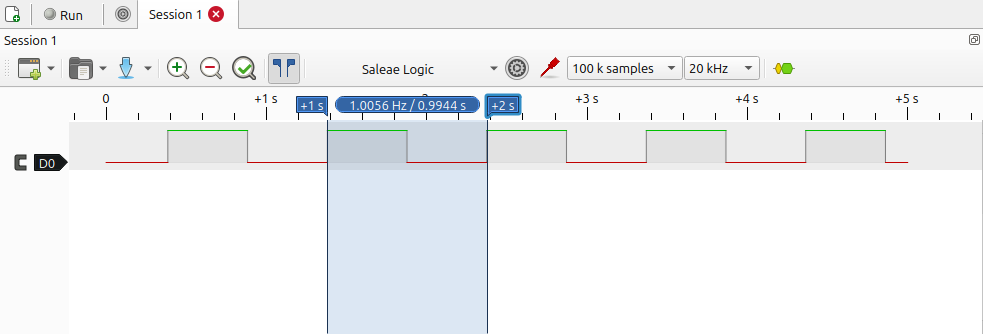
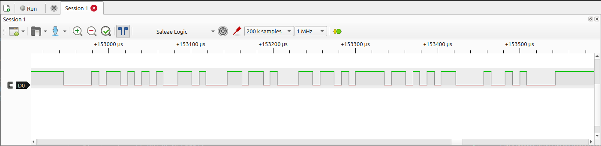
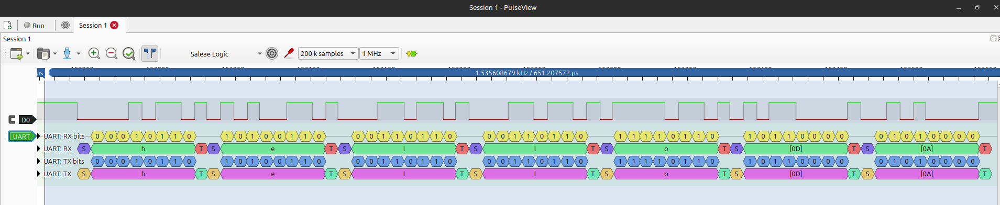
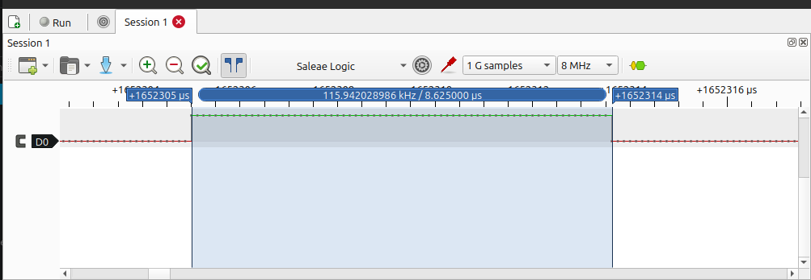

# STM32C031 bare-metal firmware

Bare-metal firmware for the **NUCLEO-C031C6** (STM32C031C6, Cortex-M0+, 32 KB Flash, 12 KB SRAM), written without HAL, without CubeMX, and without vendor startup code.

Every register definition, the linker script, the vector table and the reset handler are written by hand from **RM0490** (STM32C0 reference manual), **PM0223** (Cortex-M0+ programming manual) and the STM32C031 datasheet.

I did use ST's debugger nad flashing tools, I only wanted to use hand written instead of generated code, not refuse vendor tooling.

**If you only read four things:**

- [Trimming the internal oscillator](#trimming-it-out) from +0.5% to -0.06% error, and working out where the granularity floor is rather than stopping when it looked good enough
- [One UART bit measured at 8.625 µs](#the-independent-measurement) against 8.667 predicted, with an honest note on why the analyser cannot resolve the difference
- [An interrupt handler that was 2.3x over its time budget](#measured-the-isr-was-too-slow-before-it-was-wrong), found by counting instructions against the 86.8 µs byte time rather than guessing at a race
- [A test suite checked against deliberately broken code](#testing-a-driver-without-hardware), because passing tests only prove the tests run

---

## Status

This is a work in progress. What follows is what actually runs and is tested, not a plan.

### Implemented

**Bit manipulation library** (`drivers/include/bitops.h`) Header-only C, six `static inline` functions for register field access: `make_mask`, `insert`, `extract`, `set_bits`, `clear_bits`, `test_bits`. Covered by host-side GoogleTest cases including the boundary conditions that actually bite: zero width, full 32-bit width, top-bit fields, and overwriting an existing field value (the case that catches a forgotten clear-before-OR).

**Linker script** (`linker/stm32c031c6.ld`) Memory regions taken from the datasheet: Flash at `0x08000000` (32 KB), SRAM at `0x20000000` (12 KB). Defines `.isr_vector`, `.text`, `.data` and `.bss`, the load-address/runtime-address split for `.data`, and `top_of_stack` derived from `ORIGIN(SRAM) + LENGTH(SRAM)`.

**Startup code** (`drivers/src/startup.c`) Full 48-entry vector table transcribed from RM0490's interrupt table, placed at `0x08000000`. Unused handlers resolve to a single `DefaultHandler` through `__attribute__((weak, alias(...)))`, so a real handler defined anywhere else silently overrides the default at link time. `Reset_Handler` copies `.data` from Flash to SRAM, zeroes `.bss`, and calls `main`.

**Blinky** (`app/main.c`) Direct register writes: GPIOA clock enable in `RCC_IOPENR`, PA5 to output mode in `GPIOA_MODER`, toggle via `GPIOA_ODR`.

**SysTick and `delay_ms()`** (`drivers/src/systick.c`) Defined the four SysTick registers from PM0223 as a `volatile uint32_t` struct at `0xE000E010`. `systick_init()` writes the reload value, clears the current count, then enables the counter with its interrupt, in that order. `SysTick_Handler` increments a `static volatile` millisecond counter, and `delay_ms()` waits on the difference, using unsigned subtraction so it stays correct across a counter wrap. The handler needs no registration: defining it here overrides the weak alias in `startup.c` at link time, which `nm` confirms: `SysTick_Handler` moves off `DefaultHandler`'s address onto its own.

**Register definitions** (`drivers/include/stm32c031_regs.h`) A `GPIO_Regs` struct and a `USART_Regs` struct, both `volatile uint32_t` members in RM0490's register order, written by hand from the manual rather than taken from a vendor header. The struct layout *is* the memory map, so a `static_assert` on `offsetof` pins every member to its documented offset, plus one on each total size. A member added, reordered or mis-padded becomes a build failure naming that member, instead of silently redirecting every access after it.

**GPIO driver** (`drivers/src/gpio.c`) `gpio_set_mode`, `set_pull`, `set_otype`, `set_ospeed`, `set_af`, `gpio_write` and `gpio_read`, each taking a `GPIO_Regs *` rather than hard-coding a base address. Field writes go through `bitops.h`. `gpio_write` uses `BSRR` rather than a read-modify-write on `ODR`: bits 15:0 set, bits 31:16 clear, zeros do nothing, so a single store cannot race an interrupt touching the same port.

**UART driver, polled transmit** (`drivers/src/usart.c`) `uart_init`, `uart_write_byte` and `uart_write_string` on USART2, the instance wired to the on-board ST-LINK's virtual COM port. `uart_init` takes a `USART_Regs *`, the peripheral clock frequency and the desired baud rate, so the divisor is computed rather than hard-coded and the driver stays testable off-target. It clears `UE` before writing `BRR`, since that register is only writable while the USART is disabled, then sets `TE` and `UE` last. 8N1 is the reset state of `M1:M0`, `PCE` and `STOP`, so the driver leaves those fields alone rather than writing values it would only be restating. Transmit polls `TXE` in `ISR` before each store to `TDR`.

**Interrupt-driven UART** (`drivers/src/usart.c`) `USART2_IRQHandler` services both directions. Receive: the handler reads `RDR`, which is also what clears `RXNE`, and pushes into the RX ring. Transmit: `uart_write_byte` queues into the TX ring and enables `TXEIE`; the handler pops one byte per interrupt and clears `TXEIE` when the ring runs dry, since `TXE` is set almost permanently and would otherwise re-fire forever with nothing to send. `uart_write_byte` blocks when the ring is full rather than dropping, bounded by the 5.5 ms it takes to drain 63 bytes at 115200. Verified by echoing 16 KB through the board and comparing byte for byte.

**Critical sections** (`drivers/include/critical.h`) Two `static inline` functions over `cpsid i` and `PRIMASK`, in inline assembly, since Cortex-M0+ has no `LDREX`/`STREX` and therefore no lock-free atomic read-modify-write. They save and restore the previous mask rather than unconditionally re-enabling, so a critical section nested inside another one cannot hand interrupts back early.

**Ring buffer** (`drivers/src/ringbuffer.c`) A fixed 64-byte FIFO with no allocation, written for the interrupt-driven UART that comes next: an ISR drops bytes in and returns, `main` takes them out whenever it gets there. Indices wrap with `& (RBSIZE - 1)` rather than a modulo, because Cortex-M0+ has no divide instruction. One slot is left unused so that `head == tail` can only ever mean empty, which makes the single-producer, single-consumer case correct with no critical sections: the producer writes only `head`, the consumer writes only `tail`, and neither needs to disable interrupts. The alternative, a shared occupancy count, is written by both sides and would need one. Capacity is therefore 63 bytes, which several tests assert directly. Covered by 13 host tests.

**Clock tree** The reset clock path is documented end to end in
[`docs/NOTES.md`](docs/NOTES.md): HSI48 (48 MHz) -> `HSIDIV` ÷4 -> HSISYS -> `SW` mux ->
`SYSDIV` ÷1 -> SYSCLK -> `HPRE` ÷1 -> HCLK = **12 MHz** at the core, with the controlling register field and bit range for each stage. Verified by reading `RCC_CR` off the chip at the reset halt, and by deliberately changing `HSIDIV` to ÷8 and observing the blink rate halve.

### Not yet implemented

The scope below is the plan, not a promise, it gets revised as I go, and this section is updated alongside each commit.

**C layer (C17), remaining:**

- A `printf`-style formatter over the UART. Output is currently raw bytes and strings only.
- I²C master written from scratch, then a BME280 driver including the compensation maths
- SSD1306 as a second address on the same bus. Enough to prove addressing and capture two devices sharing a bus, no display driver

**Host tests for the UART driver.** `uart_init` takes a pointer and a clock frequency, so it has the same testable shape as the GPIO driver, but no suite exists for it yet. The obvious cases are the `BRR` divisor for a few clock and baud combinations, and that `TE` and `UE` end up set without disturbing the framing fields.

**Partially converted to the register-struct convention.** GPIO now follows it: `stm32c031_regs.h` defines the port as a struct, and every driver function takes a pointer to one. Firmware passes the hardware address, tests pass a struct in RAM. RCC and SysTick still poke fixed addresses directly and will be converted as those drivers are written.

**C++17 layer** (`hal/`, empty until the C drivers exist). It exists to answer one question: can modern C++ make register access safer than the C layer at zero cost? Type-safe registers via templates where an illegal write fails at compile time, RAII for I²C transactions so a stop can never be missed on an early return, `-fno-exceptions -fno-rtti`, `std::span` over the C layer's buffers, `enum class` for modes and errors.

**The measurement.** The same I²C register read performed two ways, through the C driver directly and through the C++ wrapper, comparing `.text` size and cycle counts against a stripped baseline. Table to follow here.

**Deferred until after the October gate:** timer/PWM output and ADC (internal temperature sensor and VREFINT).

**Not attempted:** input capture / encoder mode (no encoder in the kit) and DMA, which is a genuine gap and the highest-value addition if time appears later.

---

## Measured: the 1 Hz blink

SysTick is configured for a 1 ms tick from a 12 MHz HCLK, a reload of 11999, since the counter runs down *through* zero and so takes `RVR + 1` cycles per period. The LED toggles every 500 ms, giving one full cycle per second.



Verified on PA5 (Arduino D13 header) with two independent instruments:

| Target | Logic analyser | Multimeter | Deviation |
|---|---|---|---|
| 100 Hz (`delay_ms(5)`) | 100.5 Hz | 100.5 Hz | +0.5% |
| 1 Hz (`delay_ms(500)`) | ~1.005 Hz | ~1.005 Hz | +0.5% |

Both instruments agree at both frequencies, which rules out measurement error. The interesting part is that the deviation is **the same 0.5% at both frequencies**, and that is what identifies the cause.

A mistake in the firmware would be quantised: an off-by-one in the reload value is 1/12000 = 0.008%, a miscounted tick is 1/5 = 20%. No integer error in this code produces 0.5%. That would be 60 cycles out of 12000, and there is no 60 anywhere in it. Fixed per-call overhead is ruled out too, because overhead would be proportionally large at `delay_ms(5)` and negligible at `delay_ms(500)`; the error would shrink between the two rows above, and it doesn't.

A time base running 0.5% fast explains it exactly, and scales everything uniformly. HSI48 is an RC oscillator factory-trimmed, but temperature- and voltage-dependent, so 48.24 MHz instead of 48.00 gives a 12.06 MHz HCLK, a 0.995 ms tick, and a 9.95 ms period where 10 ms was intended.

RM0490 states that each device is factory calibrated to **1 % accuracy at TA=25°C**, so +0.5% on a room-temperature bench is half that and well inside spec. It is also correctable: `RCC_ICSCR` at `0x40021004` holds the factory value in `HSICAL[7:0]` and a software trim in `HSITRIM[14:8]`.

Worth noting what *cannot* drift here: interrupt latency. SysTick reloads in hardware the instant the counter reaches zero, independent of when the CPU services the handler. Late interrupts cause jitter, never accumulating error.

### Trimming it out

Datasheet Table 41 gives the user trimming step as 0.3% typical per code, so I stepped `HSITRIM` and re-measured at 100 Hz, inside my multimeter's working range:

| `HSITRIM` | Measured | Error |
|---|---|---|
| 64 (reset) | 100.5 Hz | +0.5% |
| 65 | 100.8 Hz | +0.8% |
| 63 | 100.2 Hz | +0.3% |
| **62** | **99.94 Hz** | **-0.06%** |

Two codes moved the frequency 0.557%, so about 0.28% per code, matching the datasheet's 0.3% typical. That also fixes the limit: with a 0.28% step, code 63 would sit near +0.22% and code 62 at -0.06%, with nothing in between. **-0.06% is the granularity floor, not a stopping point chosen out of laziness.** The residual error is now smaller than the spread between successive readings on either instrument.

Two honest caveats:
- This cancels *this die's* manufacturing offset at bench temperature; 
- 62 is specific to this chip, so it is a measured constant that might not be the same on other boards.

---

## Measured: UART at 115200

USART2 transmits on PA2, which the board routes to the ST-LINK's virtual COM port, so the same signal reaches both `picocom` and a logic analyser probe on the morpho header.

`BRR` is the peripheral clock over the baud rate, and with `OVER8` at its reset value of 0 that is the whole formula. USART2 on this part has no kernel clock mux, so the clock feeding it is PCLK, which at reset prescalers equals HCLK: 12 MHz. That gives 12000000 / 115200 = 104.17, written as **104**.

Rounding to an integer is unavoidable and it costs accuracy: 12000000 / 104 is 115385 baud, **+0.16%** off the nominal 115200. A UART tolerates a few percent total mismatch across both ends, so this is not close to a problem, but it is the reason the measured bit time below is not exactly 1/115200.

### What the analyser saw

Raw capture on PA2, no decoder, one burst of `hello\r\n`:



The same capture with PulseView's UART decoder set to 115200 8N1:



`h e l l o [0D] [0A]`, which is the string with its CRLF. Worth being precise about what this proves: a decoder told to assume 115200 recovered correct ASCII, so the transmitted rate is within the decoder's tolerance of 115200. It is a confirmation, not an independent measurement.

### The independent measurement

Measuring one bit directly is the part that does not assume the answer:



**8.625 µs**, which PulseView reports as 115.942 kHz.

| | Bit time |
|---|---|
| Nominal 115200 | 8.681 µs |
| Predicted from `BRR` = 104 at 12 MHz | 8.667 µs |
| Measured | 8.625 µs |

The measurement sits 0.042 µs below the prediction. That gap is smaller than the analyser can resolve: at the 8 MHz sample rate used here one sample is 0.125 µs, so an 8.667 µs bit can only be reported as 8.625 (69 samples) or 8.750 (70 samples), and 8.625 is the nearer of the two. The measurement
therefore confirms the configuration to within the instrument's resolution and cannot resolve the 0.16% rounding error in `BRR`.

The first capture I took was at 1 MHz, which is about 8.7 samples per bit. The decoder still worked, because a decoder only needs to sample near the middle of each bit, but the bit-width reading was useless at 1 µs granularity. Raising the sample rate to 8 MHz is what made the number mean anything.

What this does establish is that the 12 MHz figure the whole clock derivation rests on is right. An error in `HSIDIV`, in the `SW` mux or in the APB prescaler would move the bit time by a factor of two or more, not by a few tens of nanoseconds. The serial output is a second instrument agreeing with the blink measurement, derived from a completely different peripheral.

---

## Sharing a buffer between an ISR and main

The UART has two ring buffers, one per direction, and they need different amounts of protection. Working out which needs what is the whole point of the exercise.

### Receive needs no lock

The handler only ever writes `head`. `main` only ever writes `tail`. Each index has exactly one writer, and each side only reads the other's. There is no read-modify-write of shared state anywhere, so there is nothing to make atomic.

That argument needs two things to be true, and both are asserted in `ringbuffer.h` rather than assumed:

- the indices are `volatile`, so the compiler cannot cache one in a register across a loop and miss an update made by the other context
- a load or store of one index is a single instruction, so it can never be observed half-done. On Cortex-M0+ an aligned 32-bit access is one  instruction, which is why there are `static_assert`s on both the width and the alignment of `head` and `tail`

Understanding why this is safe is worth more than reflexively disabling interrupts around it.

### Transmit does

The TX path shares something the RX path does not: the `TXEIE` bit. `main` sets it to say "I have queued work", and the handler clears it when the ring runs dry. Two writers, one piece of state.

The hazard is not the bit itself but the register it lives in. `CR1` also holds `UE`, `TE`, `RE` and `RXNEIE`, and there is no way to set one bit without writing all 32:

```
LDR  r0, [CR1]
ORR  r0, #0x80
STR  r0, [CR1]
```

If the handler changes any bit of `CR1` between the load and the store, the store writes the stale value of every other bit back over it, and the handler's change silently disappears.

This is the same hazard as a read-modify-write on GPIO's `ODR`, but with no way out. GPIO has `BSRR`, a write-only register that sets bits with a single store and never reads. `CR1` has no equivalent, and Cortex-M0+ has no `LDREX`/`STREX` either. Masking interrupts is the only tool left, which is what `critical.h` provides.

One deliberate design choice narrows the problem further: `uart_write_byte` enables `TXEIE` **unconditionally** after every put, rather than first checking whether the ring was empty. That removes a check-then-act sequence entirely, so `main` can only ever set the bit and the handler can only ever clear it after observing an empty ring. The worst case left is a redundant interrupt that finds nothing to do. The critical section is protecting the read-modify-write, not a check-then-act race, and that is a more precise claim than "I put a lock around it".

---

## Measured: the ISR was too slow before it was wrong

The first full-speed test lost more than half the data: 4096 bytes sent, 1853 returned. The cause was not a race. It was that the handler could not run fast enough, and the build settings were why.

The ARM build had `CMAKE_C_FLAGS_DEBUG` set to `-g` with no `-O` flag, which means `-O0`. At `-O0` GCC inlines nothing, including functions marked `static inline`. Every `bitops` and ring buffer helper in the handler became a real call with its own stack frame:

| Build | ISR body | Calls out of it | Firmware text |
|---|---|---|---|
| `-O0` | 87 instructions | **9** | 2868 |
| `-Og` | 45 | 2 | 1464 |
| `-O2` | 43 | 2 | 1576 |

The nine calls are what cost. `extract` is 46 instructions on its own and calls `make_mask`, which is another 90, so three `extract` calls alone are over 400 instructions. Counting the callees, one pass through the handler was roughly **800 instructions**, about 1200 cycles, which at 12 MHz is near **100 us**.

The budget is fixed by the line: at 115200 a byte takes **86.8 us**, and
echoing needs two interrupts per byte, one to receive and one to transmit. So the handler needed about 200 us per byte and had 86.8. Roughly 2.3x over, which is why the receiver overran continuously.

At `-Og` the same path is about 85 instructions, near 10 us, comfortably inside the budget. The fix was one line in `CMakeLists.txt`, and after it all three load tests passed.

The lesson worth keeping is that an ISR has a real time budget set by the
hardware, not by taste, and that a debug build can miss it while a release build makes it. Measuring the instruction count against the byte time is how you tell whether you are close to the edge, rather than discovering it under load.

### Raising it to `-O2` breaks the link, interestingly

```
ld: (memset): Unknown destination type (ARM/Thumb) in startup.c.obj
```

At `-O2` GCC recognises the `.bss` zeroing loop in `Reset_Handler` as a
`memset` and replaces the hand-written loop with a call to it. `memset` lives in libc, which `-nostdlib` deliberately excludes. The compiler optimised a loop into a call to a function the project had chosen not to link. `-fno-tree-loop-distribute-patterns` disables that one transformation. The flag is in `CMakeLists.txt` with a comment, even though `-Og` does not need it, so that raising the level later does not reopen the question.

### How it was verified

`tools/uart_loadtest.py`, standard library only, no pyserial. It pushes a
counted pattern through the board's echo loop and compares byte for byte, while reading on a separate thread so both directions are busy at once. The pattern repeats every 251 bytes rather than every 256, so it never lines up with the 64 byte ring and a swapped or repeated block shows as a mismatch instead of hiding behind an identical byte.

```bash
python3 tools/uart_loadtest.py                  # 4096 bytes, 64 byte writes
python3 tools/uart_loadtest.py --chunk 1        # one byte at a time
python3 tools/uart_loadtest.py --bytes 16384    # wraps the rings ~260 times
```

The `--chunk 1` run matters most: it keeps both rings near empty, so `TXEIE` is enabled and disabled thousands of times instead of a handful, which is the condition the TX race needs. A ten byte test proves nothing here.

The script reports when the first and last bytes arrived and prints an explicit `STALLED` line if data stops early, because a link that is merely slow and one that worked and then died look identical in a total byte count.

---

## Hardware and toolchain

| | |
|---|---|
| Board | NUCLEO-C031C6 (on-board ST-LINK/V2.1) |
| MCU | STM32C031C6, Cortex-M0+, 32 KB Flash, 12 KB SRAM |
| Toolchain | Arm GNU Toolchain **15.3.Rel1** (`arm-none-eabi-gcc`) |
| Host tests | GoogleTest, fetched by CMake at configure time |
| Flash / debug | STM32CubeCLT: `STM32_Programmer_CLI`, `ST-LINK_gdbserver` |

The toolchain version is pinned to `15.3.Rel1` in [`.github/workflows/ci.yml`](.github/workflows/ci.yml) so CI builds with the same compiler as the development machine.

Current firmware size:

```
   text    data     bss     dec     hex
   1464       0     148    1612     64c
```

---

## Building

Two build directories from one source tree. The compiler is fixed at configure time, so each needs its own.

**Host: builds and runs the unit tests:**

```bash
cmake -S . -B build
cmake --build build
ctest --test-dir build --output-on-failure
```

**ARM: cross-compiles the firmware:**

```bash
cmake -S . -B build-arm -DCMAKE_TOOLCHAIN_FILE=cmake/arm-none-eabi.cmake -DCMAKE_BUILD_TYPE=Debug
cmake --build build-arm
```

The split is driven by `if(CMAKE_CROSSCOMPILING)` in the top-level `CMakeLists.txt`; GoogleTest can't build for a bare-metal target, and firmware makes no sense on a laptop, so each branch takes only its half.

**Flashing:**

```bash
STM32_Programmer_CLI -c port=SWD -w build-arm/firmware.elf -rst
```

**Debugging:** [`.vscode/launch.json`](.vscode/launch.json) is configured for Cortex-Debug with ST-LINK, halting at `Reset_Handler` and loading `svd/STM32C031.svd` for the peripheral register view. The `serverpath`, `stm32cubeprogrammer` and `gdbPath` entries are absolute paths to my toolchain install and will need changing elsewhere.

---

## Verifying the memory layout

```bash
arm-none-eabi-objdump -h build-arm/firmware.elf
arm-none-eabi-nm -n build-arm/firmware.elf
```

What this should show, and why it matters:

```
0 .isr_vector   000000c0  08000000  08000000
1 .text         000004f8  080000c0  080000c0
2 .data         00000000  20000000  080005b8
3 .bss          00000094  20000000  080005b8
```

`.isr_vector` sits at `0x08000000`: the vector table has to be the first thing in Flash or the core can't find the initial stack pointer and reset vector on boot.

`.bss` is now 148 bytes: two 72-byte ring buffers and the SysTick counter.

`.data` and `.bss` share a VMA of `0x20000000` but `.data`'s LMA is in Flash, because initialized globals are stored in the image and copied to SRAM at startup, which is exactly what the copy loop in `Reset_Handler` does. `.data` is currently empty and `.bss` holds only the SysTick tick counter, since the firmware has no initialized globals at the moment. Adding `uint32_t x = 0xDEADBEEF;` to `main.c` makes `.data` grow by four bytes and its LMA and VMA visibly diverge, which is the quickest way to watch the copy loop do something in the debugger.

---

## Repository layout

```
app/                 application entry point
drivers/include/     C headers (bitops.h, stm32c031_regs.h, gpio.h, systick.h, usart.h, ringbuffer.h, critical.h)
drivers/src/         C sources (startup.c, systick.c, gpio.c, usart.c, ringbuffer.c)
hal/                 C++17 layer (empty until the C drivers exist)
tests/               GoogleTest suites, host-only
linker/              linker script
cmake/               ARM toolchain file
svd/                 CMSIS-SVD register descriptions (for the debugger)
images/              measurement captures referenced from this README
tools/               host-side test scripts (uart_loadtest.py)
docs/                NOTES.md, the working log (reference PDFs are gitignored)
.github/workflows/   CI
```

---

## Testing a driver without hardware

58 GoogleTest cases run on the host, with no board attached. That is possible because no driver function knows its own address:

```c
void gpio_set_mode(GPIO_Regs *port, uint32_t pin, gpio_mode_t mode);
```

Firmware passes `GPIOA`, which is a macro for the real base address. A test passes the address of an ordinary zeroed struct in RAM, calls the driver, and inspects what changed. The driver cannot tell the difference.

Each test asserts two things: the intended field took the intended value, and neighbouring fields did not move. The second half is the one that earns its keep, since most register bugs are collateral damage rather than a wrong value in the right place. Specific cases worth calling out:

- `gpio_set_af` on pin 7 and pin 8, which sit either side of the `AFR[pin / 8]` boundary between the low and high registers
- `gpio_write` set and clear, checking `BSRR`'s two halves are not swapped
- writing `11` then `01` to the same `MODER` field, which fails if the old value is OR'd rather than cleared first

The ring buffer is tested the same way, and it is the module where this pays off most, since off-by-one errors are the entire hazard. Alongside the obvious cases there are three that only check failure paths: that a rejected `put` moves no index and corrupts no stored byte, that a failed `get` does not write through its out-pointer, and that a stored `0x00` is returned as data rather than mistaken for emptiness.

Both suites have been checked against deliberately broken code, not just working code. Swapping `BSRR`'s set and clear branches fails exactly the two GPIO write tests and nothing else. On the ring buffer:

| Bug introduced | Tests that fail |
|---|---|
| `rb_is_full` comparing the wrong index | 6 |
| Advancing an index without the `+ 1` | 11 |
| Dropping the wrap mask entirely | 4 |
| Writing through `out` before the empty check | 1 |

The last row is the argument for writing failure-path tests at all. Only one case catches it, every happy path still passes, and without that single test the bug ships silently.

## CI

Three jobs on every push and pull request ([`ci.yml`](.github/workflows/ci.yml)):

- **host**: configure, build, run the full `ctest` suite
- **build-arm**: install the pinned toolchain, cross-compile the firmware, and
  report binary size
- **lint**: `clang-tidy` (using the `compile_commands.json` CMake exports) and `cppcheck`

The size report runs `arm-none-eabi-size` and writes it to the GitHub Actions
job summary, so Flash and SRAM usage is visible on every push without digging
through logs. Flash usage is `text + data`; SRAM usage is `data + bss`.

---

## What I got wrong

[`docs/NOTES.md`](docs/NOTES.md) is a running log of the mistakes I made building this and what fixed each one: kept because most of them are easy to repeat. A sample:

- **The SVD disagrees with the reference manual.** ST's own `STM32C031.svd` gives `RCC_CR` a reset value of `0x00000500`, putting `HSIDIV` at ÷1 and implying a 48 MHz boot clock. RM0490 says ÷4, and its revision history records the correction. I read the register off the chip and got `0x00001540`. The manual is right, the SVD is wrong on two fields, and the silicon settles it.
- **A vector table entry is one greater than the function it points to.** `Reset_Handler` is at `0x08000218`; the table holds `0x08000219`. That's the Thumb bit, and a cleared bit 0 means an immediate HardFault.
- **A blinking LED hid a wrong register read.** My first read-modify-write on `ODR` read `MODER` instead. The LED blinked correctly anyway, because bit 5 was still being set and cleared as intended, so the symptom I was watching for was present while the code was wrong.

`docs/NOTES.md` also holds the full clock-path derivation and a written answer to "what happens between reset and `main()`".
